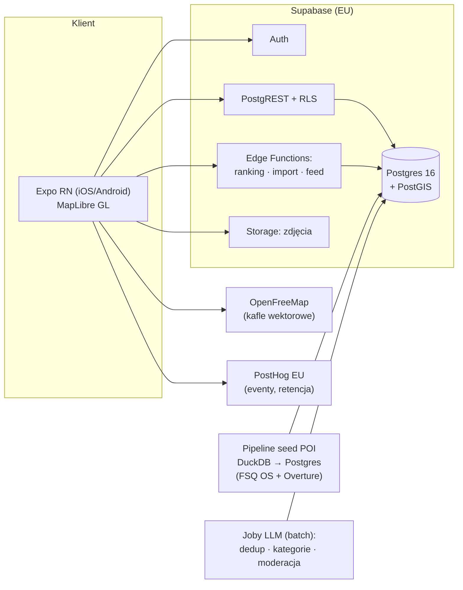

# Mapa Znajomych — projekt techniczny MVP

Wersja 1 · 2026-08-30 · dokument założycielski produktu.

Kontekst i uzasadnienie rynkowe: research-brief (artifact „Mapa Znajomych”). Ten dokument
przekłada wnioski briefu na decyzje techniczne. Produkt rozwija się **poza reżimem Foundry**
do czasu pozytywnego kill-testu; wejście pod Foundry jest jawnym punktem decyzyjnym po walidacji.

## 1. Cel i zakres

**Pozycjonowanie — zasada babci.** Produkt nie sprzedaje „lepszych recenzji”, tylko
**personalizację**: chcesz iść gdzie indziej niż twoja babcia, a jedna wspólna średnia nie
potrafi tego powiedzieć. Miejsce z oceną 4,6 od tysiąca obcych to informacja o wszystkich
i o nikim. Ta sama Starówka wygląda inaczej dla dwudziestolatka i dla wycieczki autokarowej —
i to jest cała teza.

Konsekwencja techniczna jest twarda i obowiązuje wszędzie: **nigdzie nie liczymy ani nie
pokazujemy średniej globalnej miejsca.** Każda liczba na ekranie jest czyjaś — moja albo
moich znajomych, ważona zbieżnością gustu. Miejsce bez sygnału zostaje bez liczby; nie
podstawiamy w to miejsce popularności. Reguła jest zapisana w komentarzu migracji
`0003_ranking.sql` i pilnowana testem (`supabase/tests/ranking_test.sql`).

**Cel MVP:** kill-test tezy „ocena ważona zaufaniem znajomych bije anonimowe gwiazdki” —
w 12 tygodni, na zamkniętej grupie zaproszonych.

**Teza produktowa:** mapa miejsc, na której każde miejsce ma trzy warstwy sygnału:
1. **mój ranking** (tożsamość gustu — wartość przy zerze znajomych),
2. **wynik znajomych** (zaufanie — wartość przy 3–6 znajomych),
3. **predykcja z podobieństwa gustu** (skala — poza zakresem MVP).

**Zakres startowy:**
- **Gdańsk, Starówka** — Główne Miasto, Stare Miasto, Wyspa Spichrzów
  (bbox `18.638, 54.340 → 18.672, 54.360`). Poligon wybrany celowo: gęsta scena w promieniu
  spaceru, gdzie „turystyczna pułapka obok miejsca dla swoich” jest doświadczeniem
  codziennym — czyli dokładnie tam, gdzie różnica między moją oceną a średnią boli najbardziej;
- jedna kategoria-wabik: **gastro** (`food`; `cafe` i `drinks` jako drugorzędne — porównania
  parowe mają sens wyłącznie wewnątrz kategorii),
- invite-only (kody zaproszeń, graf znajomych budowany wyłącznie zaproszeniami),
- platformy: iOS + Android z jednego kodu.

**Poza zakresem MVP (jawnie):** globalny rec score (CF na obcych), warstwa publiczna/obcy,
wiele miast, rezerwacje, czat, live-lokalizacja, web-app, widgety. Sekcja 13.

## 2. Decyzje architektoniczne

| # | Decyzja | Wybór | Uzasadnienie | Odrzucone |
|---|---|---|---|---|
| D1 | Aplikacja | **Expo (React Native) + TypeScript** | jeden kod na iOS+Android; EAS Update = OTA-poprawki w godziny podczas bety (kluczowe dla tygodniowej pętli iteracji); push notifications; dojrzały `@maplibre/maplibre-react-native` | PWA (tarcie na iOS: brak share-sheet, słabe push, brak obecności w App Store — a Gen Z instaluje ze store'a); natywny Swift (podwójna praca przy Androidzie, solo nie do udźwignięcia) |
| D2 | Backend | **Supabase** (Postgres 16 + PostGIS, Auth, Storage, Edge Functions, RLS) | zero-ops dla solo; auth i storage z pudełka; RLS jako model prywatności; region EU (Frankfurt) dla RODO | własny serwer (Fastify/Hetzner) — więcej kontroli, więcej opsu; przesadzone przed walidacją |
| D3 | Mapa | **MapLibre GL Native + kafle OpenFreeMap** | $0, bez klucza; fallback: self-host Protomaps PMTiles (~$10/mies.) gdy OpenFreeMap zawiedzie | Google Maps SDK (ToS wiąże z Google Places), Mapbox (vendor, $ po progu) |
| D4 | Dane POI | **seed: Foursquare OS Places + Overture** (bbox miasta, kategorie gastro), miejsca dodawane przez userów jako pełnoprawne | otwarte licencje (Apache 2.0 / CDLA-P), wolno cache'ować; lekcja Corner: pin od usera > pin ze scrapingu | Google Places (ToS: zakaz wyświetlania na nie-Google'owej mapie, zakaz cache), Yelp Fusion (od $229/mies., słabe pokrycie PL) |
| D5 | Wyszukiwanie | **pg_trgm + unaccent** na tabeli `places` w obrębie miasta | kilka tys. wierszy — trywialne; apka jest place-centric, geokodowanie adresów zbędne w MVP | Typesense/Meilisearch (osobny serwis do utrzymania — bez potrzeby przy tej skali) |
| D6 | Analityka | **PostHog Cloud EU** (darmowy próg) | eventy + retencja + funnele bez własnej infry; region EU | własny stack (za wcześnie), Amplitude ($) |
| D7 | Operacje LLM | **batchowe skrypty (Claude API)** poza ścieżką requestu | dedup POI, normalizacja nazw, tagowanie kategorii, triage zgłoszeń — nocne joby, koszt $5–20/mies. | LLM w ścieżce online (koszt, latencja, brak potrzeby) |
| D8 | Prywatność | **domyślnie: widoczne dla znajomych**; brak live-lokalizacji — jedyne dane miejsca to jawne logi usera | lekcja 10 z briefu (lęk o prywatność); minimalne PII: e-mail + handle | publiczne profile na starcie (ryzyko chłodu i spamu bez masy krytycznej) |

## 3. Architektura systemu



Zasady:
- **logika rankingu wyłącznie po stronie serwera** (Edge Function / funkcje SQL w transakcji) —
  klient nie liczy pozycji ani score'ów;
- **RLS jako jedyny model dostępu** — każda tabela ma politykę; klient rozmawia z PostgREST
  bezpośrednio tam, gdzie wystarczy CRUD;
- kafle i zdjęcia poza ścieżką API (CDN OpenFreeMap, Supabase Storage z podpisanymi URL-ami).

## 4. Model danych

```sql
-- tożsamość i graf
users(id uuid pk, handle citext unique, display_name text, avatar_url text,
      home_city text, created_at timestamptz);
invites(code text pk, inviter_id uuid → users, used_by uuid → users null,
        created_at, used_at);
friendships(user_a uuid, user_b uuid, status text check in (pending, accepted),
            requested_by uuid, created_at, pk(user_a, user_b));  -- a < b, symetryczna

-- miejsca
places(id uuid pk, city text, name text, normalized_name text,
       category text check in (food, cafe, drinks, culture, chill, other),
       geom geography(point, 4326), address text,
       source text check in (fsq, overture, osm, user), source_ref text,
       status text check in (active, closed, pending, duplicate),
       duplicate_of uuid → places null,
       created_by uuid → users null, created_at, updated_at);
-- indeksy: gist(geom), gin(normalized_name gin_trgm_ops), (city, category, status)

-- aktywność
logs(id uuid pk, user_id, place_id, visited_on date, note text,
     photo_paths text[], created_at);        -- log uruchamia przepływ rankingu

-- ranking (pozycje = źródło prawdy; score = pochodna)
rankings(user_id, category, place_id, bucket text check in (liked, fine, disliked),
         position int,                        -- 1 = najlepsze w kubełku
         score numeric(3,1),                  -- przeliczany po każdej zmianie
         updated_at, pk(user_id, category, place_id),
         unique(user_id, category, bucket, position));
comparisons(id bigint pk, user_id, category, winner uuid, loser uuid,
            skipped bool default false, created_at);   -- ślad audytowy, nie stan

-- listy
lists(id uuid pk, owner_id, name text, emoji text, kind text check in (custom, want_to_try));
list_items(list_id, place_id, note text, added_at, pk(list_id, place_id));

-- podobieństwo gustu (materializowane nocnym jobem)
taste_similarity(user_a uuid, user_b uuid, tau numeric, common_count int,
                 computed_at, pk(user_a, user_b));

-- feed i moderacja
activity(id bigint pk, user_id, kind text check in (logged, ranked, added_place, listed),
         place_id uuid, payload jsonb, created_at);  -- feed = pull po znajomych
reports(id uuid pk, reporter_id, target_kind text, target_id uuid,
        reason text, status text, created_at);
```

RLS (szkic): `logs`, `rankings`, `lists(custom)`, `activity` czytelne dla właściciela
i zaakceptowanych znajomych; `places` czytelne dla wszystkich zalogowanych; zapisy
wyłącznie właściciel. `want_to_try` prywatna dla właściciela (lekcja „gatekeep” Corner —
opcja udostępnienia to świadomy gest, nie default).

## 5. Mechanika rankingu i score'ów

### 5.1 Wstawianie miejsca do rankingu (przepływ po logu)

1. **Kubełek:** „podobało się / było ok / nie podobało się” → `liked | fine | disliked`.
2. **Pojedynki:** wyszukiwanie binarne wewnątrz kubełka — „lepsze niż X?” przeciw miejscu
   ze środka przedziału; ~log₂(n) porównań (przy 40 miejscach w kubełku: ~5 pytań).
   Każdy pojedynek zapisany w `comparisons`.
3. **Pomiń** jest legalne: miejsce ląduje w środku bieżącego przedziału,
   porównanie zapisane ze `skipped = true`.
4. **Przeliczenie score:** po wstawieniu — jedna transakcja przesuwa `position` i przelicza
   `score` całej kategorii usera (dziesiątki wierszy — koszt pomijalny).

Mapowanie pozycja → score (wzorzec Beli, zakresy kubełków):

```
liked    → [6.7, 10.0]
fine     → [3.4,  6.6]
disliked → [0.0,  3.3]

score = hi − (hi − lo) · (position − 1) / max(1, n_bucket − 1)
```

Implementacja: funkcja SQL `rank_insert(user, category, place, bucket, position)`
wołana z Edge Function `finish_ranking`; blokada `select … for update` na wierszach
`(user, category)` gwarantuje spójność `unique(bucket, position)`.

### 5.2 Wynik znajomych (ocena ważona zaufaniem)

Dla oglądającego `v` i miejsca `p`:

```
friend_score(v, p) = Σ_r w(v,r) · score_r(p) / Σ_r w(v,r)
   po r ∈ zaakceptowani znajomi v, którzy mają p w rankingu

w(v,r) = 0.5 + 0.5 · sim(v,r)
sim(v,r) = (τ_Kendalla + 1) / 2   na wspólnie zrankowanych miejscach;
           default 0.5, gdy wspólnych < 5
```

Własności: znajomy o zbieżnym guście waży do 2× więcej niż znajomy o przeciwnym;
nikt nie waży zera (znajomość sama w sobie jest sygnałem). `taste_similarity`
przeliczana nocnym jobem (pg_cron) — nie w ścieżce zapytania.

Zapytanie mapy (viewport): miejsca w bbox + trzy agregaty per miejsce
(mój score, friend_score, liczba logów znajomych). Przy skali MVP
(≤50 znajomych, ≤500 miejsc w viewport) liczone na żywo jednym SQL-em —
materializacja per viewer to optymalizacja po walidacji, nie przed.

### 5.3 Stan implementacji (T1)

Zweryfikowane na żywym Postgresie 16 + PostGIS (`tools/run_db_tests.sh`, 18 asercji):
przeliczanie score z pozycji, przenoszenie miejsc między kubełkami z domknięciem luki,
tau Kendalla (zgodny gust `1.0`, przeciwny `-1.0`), wagi głosów (`1.0` / `0.5`, nigdy zero),
brak wyniku przy braku sygnału. Kluczowy test dowodzi zasady babci wprost: **ten sam lokal
ma `8.9` u wnuka i `10.0` u babci**, bo każde z nich patrzy przez własny graf.

Pętla pojedynków (`app/lib/ranking.ts`) ma własne testy (`npm test` w `app/`): każda pozycja
w kubełku 40 miejsc znajdowana w ≤6 pytaniach, pominięcie kończy serię, brak zapętleń.

### 5.4 Co jawnie odroczone

Rec score z filtrowania kolaboratywnego na obcych, ważenie świeżości ocen,
odporność na shilling (przy invite-only grafie problem nie istnieje — wraca
razem z warstwą publiczną).

## 6. Pipeline danych POI

Jednorazowy seed + miesięczne odświeżenie, skrypt `tools/seed_poi.py` (DuckDB):

1. FSQ OS Places (Parquet, S3) → filtr bbox miasta + kategorie gastro;
2. Overture Places → to samo; złączenie po (nazwa znormalizowana, odległość < 75 m);
3. dedup w DuckDB (klucz blokujący: geohash-7 + trigram nazwy), konflikty → job LLM
   proponuje scalenia, człowiek zatwierdza listą;
4. załadunek do `places` ze `source` i `source_ref` (idempotentny upsert po source_ref);
5. miejsca `source = user` nigdy nie są nadpisywane przez odświeżenie.

Oczekiwana skala: 3–8 tys. aktywnych miejsc gastro dla dużego polskiego miasta.

## 7. Import „zapisanych” z Google Maps (użyteczność przy N=0)

Ścieżka: Google Takeout → użytkownik wgrywa plik `Saved Places.json` / CSV listy →
Edge Function `import_takeout`:
- parsowanie nazwa + współrzędne,
- dopasowanie do `places` (odległość < 100 m + trigram nazwy > 0.55),
- trafienia → `want_to_try`; nietrafione → propozycje `places(status=pending)`
  do jednego tapnięcia zatwierdzenia przez usera.

To zamyka zimny start treściowy pojedynczego użytkownika w pierwszej sesji.

## 8. Warstwa społeczna

- **Zaproszenia:** kod/deep-link (Expo Linking); przyjęcie kodu tworzy od razu
  `friendship(accepted)` z zapraszającym. Licznik zaproszeń per user (start: 5,
  podnoszony ręcznie) — mechanika niedoboru à la wczesne Beli.
- **Feed:** pull — zapytanie po `activity` znajomych, paginacja keyset; bez fanoutu
  (przesada przy tej skali).
- **Powiadomienia:** Expo Push; zdarzenia: znajomy dołączył, znajomy zrankował miejsce
  z twojej listy `want_to_try`, tygodniowe podsumowanie. Oszczędnie — push jest
  zapałką, nie silnikiem.
- **Profil:** ranking per kategoria (ekran tożsamości gustu — najważniejszy ekran po mapie).

## 9. Bezpieczeństwo, prywatność, RODO

- region EU (Frankfurt); PII: e-mail + handle + opcjonalny avatar — nic więcej;
- brak live-lokalizacji; lokalizacja urządzenia używana wyłącznie do wycentrowania mapy
  (uprawnienie „podczas używania”, opcjonalne);
- eksport danych (JSON przez Edge Function) i kasacja konta (kaskada + anonimizacja
  `places.created_by`) — od pierwszej wersji, nie „po RODO-audycie”;
- RLS testowane jak kod (pgTAP lub testy integracyjne na roli `anon`/`authenticated`);
- sekrety wyłącznie w Supabase Vault / EAS Secrets; repo bez `.env`.

## 10. Instrumentacja kill-testu

Eventy PostHog: `signup`, `invite_sent`, `invite_accepted`, `place_added`, `log_created`,
`ranking_finished`, `comparison_answered`, `map_viewed`, `friend_score_viewed`,
`import_completed`, `list_item_added`.

**Progi kill-testu (T12, mierzone na kohorcie bety):**

| Metryka | Próg zaliczenia |
|---|---|
| W4 retencja zaproszonych | ≥ 30% |
| Aktywni tygodniowo logujący ≥1 miejsce bez pusha | ≥ 50% WAU |
| Zaakceptowane zaproszenia na aktywnego usera | ≥ 0,5 |
| Sesje z obejrzeniem wyniku znajomych | ≥ 40% sesji |

Wynik poniżej progów = mechanika nie żre; wnioski i stop albo pivot — bez dosypywania
feature'ów. Wynik powyżej = decyzje: wejście pod Foundry, partner od dystrybucji,
druga kategoria.

## 11. Plan 12 tygodni

| Tydzień | Dostawa |
|---|---|
| T1 | repo, CI (lint+testy), Expo skeleton, Supabase (auth, schema, RLS), seed POI miasta, mapa renderuje pinezki z clusteringiem |
| T2 | ekran miejsca, dodawanie miejsca, wyszukiwarka, listy + `want_to_try` |
| T3 | przepływ logowania wizyty + ranking parowy (Edge Function + SQL) + ekran profilu/rankingu |
| T4 | zaproszenia, graf znajomych, friend_score na mapie i ekranie miejsca, feed v0 |
| T5 | import Takeout, push, polish, TestFlight + wewnętrzny track Play |
| T6 | start zamkniętej bety (15–30 osób z własnej ekipy), dashboardy PostHog |
| T7–T11 | tygodniowa pętla: feedback → OTA-iteracje; praca founder(k)a w terenie nad gęstością sceny |
| T12 | odczyt metryk vs progi → decyzja go / pivot / stop |

Reguła: od T6 kod jest podrzędny wobec terenu — budżet godzin dzielony jawnie
(np. 30% kod / 70% społeczność).

## 12. Koszty

| Pozycja | Koszt |
|---|---|
| Supabase | $0 → $25/mies. |
| Kafle (OpenFreeMap / fallback PMTiles) | $0 → ~$10/mies. |
| EAS (buildy/OTA) | $0 (darmowy próg wystarcza) |
| PostHog EU | $0 |
| Claude API (joby batch) | $5–20/mies. |
| Apple Developer / Google Play | $99/rok / $25 raz |
| Domena | ~$15/rok |
| **Razem** | **~$30–70/mies.** |

## 13. Przyszłość (po pozytywnym kill-teście — nie wcześniej)

Warstwa publiczna/obcy z proof-of-visit i moderacją; rec score (CF); tryb „planujemy
wyjście ekipą”; twórcy i mapy kuratorskie (model Muala/Atly); rezerwacje jako ścieżka
transakcyjna; drugie miasto; wejście produktu pod cykl Foundry (spec → akt → próba →
bramka) jako drugi produkt fabryki.
